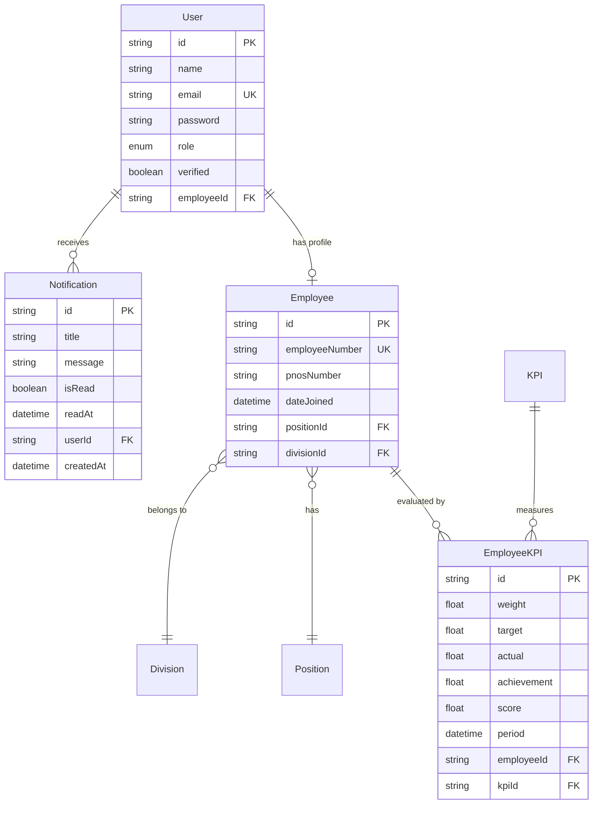

# Database Sistem KPI Karyawan

Dokumentasi untuk struktur database sistem penilaian kinerja karyawan dengan sistem perhitungan KPI yang komprehensif dan sistem notifikasi terintegrasi.

## 📋 Tentang Sistem

Sistem ini digunakan untuk mengelola penilaian KPI (Key Performance Indicator) karyawan di perusahaan dengan sistem perhitungan yang akurat berdasarkan bobot, target, dan realisasi pencapaian. Sistem dapat mencatat nilai kinerja setiap karyawan berdasarkan periode tertentu dengan fitur autentikasi pengguna yang lengkap dan **sistem notifikasi real-time**.

## 🗄️ Struktur Database

### Konfigurasi Database
```prisma
generator client {
  provider = "prisma-client-js"
}

datasource db {
  provider = "mysql"
  url      = env("DATABASE_URL")
}
```

### Enum
```prisma
enum Role {
  USER
  ADMIN
}
```

## 📚 Pengelompokan Tabel

### 🔐 TABEL AUTHENTICATION & NOTIFICATION

#### 1. **User** - Sistem Autentikasi
Tabel untuk menyimpan akun pengguna dengan sistem autentikasi lengkap.

```prisma
model User {
  id         String    @id @default(uuid())
  name       String
  email      String    @unique
  password   String
  role       Role      @default(USER)
  createdAt  DateTime  @default(now())
  updatedAt  DateTime  @updatedAt
  
  // Email verification
  verificationToken        String?
  verificationTokenExpires DateTime?
  verified                 Boolean   @default(false)
  
  // Relasi ke Employee (optional - tidak semua user harus punya data employee)
  employee   Employee? @relation(fields: [employeeId], references: [id])
  employeeId String?   @unique

  // 🆕 Relasi ke Notification - sistem notifikasi
  notifications Notification[]

  @@map("users")
}
```

**Fitur Utama**:
- Sistem autentikasi berbasis email dan password
- Role-based access (USER/ADMIN)
- Email verification dengan token dan expiry
- UUID sebagai primary key untuk keamanan
- **🆕 Sistem notifikasi terintegrasi**
- Timestamp tracking (createdAt, updatedAt)

**Relasi**: 
- 1 User ⇔ 1 Employee (one-to-one optional)  
- **🆕 1 User ⇔ banyak Notifications (one-to-many)**

**Catatan**: Tidak semua user harus memiliki data employee (admin bisa tidak punya data karyawan)

#### 2. **🆕 Notification** - Sistem Notifikasi Real-time
Tabel baru untuk menyimpan notifikasi untuk setiap user dengan sistem tracking yang lengkap.

```prisma
model Notification {
  id        String    @id @default(uuid())
  title     String    // Judul notifikasi
  message   String    // Isi pesan
  isRead    Boolean   @default(false)
  readAt    DateTime?
  
  // Penerima notifikasi
  userId    String
  user      User      @relation(fields: [userId], references: [id], onDelete: Cascade)
  
  createdAt DateTime  @default(now())
  
  // Indexing untuk performa optimal
  @@index([userId])
  @@index([isRead])
  @@map("notifications")
}
```

**Fitur Utama**:
- **title & message**: Judul dan isi notifikasi yang fleksibel
- **isRead tracking**: Status baca/belum baca dengan default false
- **readAt timestamp**: Kapan notifikasi dibaca (nullable)
- **Cascade delete**: Notifikasi terhapus otomatis jika user dihapus
- **Dual indexing**: Optimasi query berdasarkan userId dan status baca

**Contoh Penggunaan Notifikasi**:
```javascript
// Notifikasi ketika KPI diinput
{
  title: "KPI Penilaian Baru",
  message: "Penilaian KPI Anda untuk periode Januari 2025 telah diinput oleh Manager",
  userId: "user-123",
  isRead: false
}

// Notifikasi reminder target
{
  title: "Reminder Target KPI",
  message: "Target KPI 'Kehadiran' Anda bulan ini tinggal 5 hari lagi. Tetap semangat!",
  userId: "user-123",
  isRead: false
}

// Notifikasi achievement
{
  title: "🎉 Selamat! Target Tercapai",
  message: "Anda berhasil mencapai 112% dari target Bug Fix bulan ini. Excellent work!",
  userId: "user-123",
  isRead: false
}
```

### 🗂️ TABEL MASTER DATA

#### 3. **Division** - Divisi/Bagian
Master data divisi atau departemen perusahaan.

```prisma
model Division {
  id          String     @id @default(uuid())
  name        String    @unique
  description String?
  weight      Int?      // bobot divisi dalam sistem penilaian keseluruhan
  employees   Employee[]
  createdAt   DateTime   @default(now())
  updatedAt   DateTime   @updatedAt

  @@map("divisions")
}
```

**Contoh data**: IT, HR, Finance, Marketing  
**Relasi**: 1 Division ⇔ banyak Employees  
**Fitur**: 
- Nama divisi unik (`@unique`)
- Sistem bobot divisi untuk penilaian
- UUID primary key, timestamp tracking

#### 4. **Position** - Jabatan/Posisi
Master data posisi atau jabatan di perusahaan.

```prisma
model Position {
  id          String     @id @default(uuid())
  name        String
  description String?
  employees   Employee[]
  createdAt   DateTime   @default(now())
  updatedAt   DateTime   @updatedAt

  @@map("positions")
}
```

**Contoh data**: Software Engineer, Manager, HR Specialist  
**Relasi**: 1 Position ⇔ banyak Employees  
**Fitur**: UUID primary key, timestamp tracking

#### 5. **KPI** - Jenis Indikator Penilaian
Master data jenis-jenis KPI yang digunakan untuk penilaian.

```prisma
model KPI {
  id           String        @id @default(uuid())
  name         String
  employeeKpis EmployeeKPI[]
  createdAt    DateTime      @default(now())
  updatedAt    DateTime      @updatedAt

  @@map("kpis")
}
```

**Contoh data**: Disiplin, Kehadiran, Target Penjualan, Kualitas Pekerjaan  
**Relasi**: 1 KPI ⇔ banyak EmployeeKPI  
**Fitur**: UUID primary key, timestamp tracking

### 👥 TABEL DATA KARYAWAN

#### 6. **Employee** - Data Karyawan
Tabel utama yang berisi data karyawan perusahaan.

```prisma
model Employee {
  id             String        @id @default(uuid())
  employeeNumber String?       @unique  // nomor/ID karyawan perusahaan
  pnosNumber     String?       // nomor PNOS (optional)
  dateJoined     DateTime      @default(now())
  createdAt      DateTime      @default(now())
  updatedAt      DateTime      @updatedAt
  
  // Relasi ke Position dan Division
  position   Position? @relation(fields: [positionId], references: [id])
  positionId String?
  division   Division? @relation(fields: [divisionId], references: [id])
  divisionId String?
  
  // Relasi balik ke User (optional)
  user User?
  
  // Relasi ke EmployeeKPI
  employeeKpis EmployeeKPI[]

  @@map("employees")
}
```

**Berisi data**:
- Nomor pegawai unik dan nomor PNOS
- Tanggal masuk kerja - otomatis diset ke waktu sekarang jika tidak diberikan
- Hubungan ke posisi dan divisi
- Timestamp tracking

**Relasi**:
- **Employee ⇔ Position** (many-to-one) → banyak karyawan bisa punya posisi yang sama
- **Employee ⇔ Division** (many-to-one) → banyak karyawan bisa di divisi yang sama  
- **Employee ⇔ EmployeeKPI** (one-to-many) → satu karyawan punya banyak nilai KPI
- **Employee ⇔ User** (one-to-one optional) → karyawan bisa punya atau tidak punya akun user

### 📊 TABEL PENILAIAN KPI

#### 7. **EmployeeKPI** - Nilai KPI Karyawan dengan Sistem Perhitungan Lengkap
Tabel untuk menyimpan nilai KPI setiap karyawan per periode dengan sistem perhitungan yang komprehensif dan audit trail.

```prisma
model EmployeeKPI {
  id          String   @id @default(uuid())
  weight      Float    // bobot KPI individual (%)
  target      Float    // target yang ditetapkan
  actual      Float    // realisasi (pencapaian nyata)
  achievement Float    // nilai akhir (weight * score )
  score       Float    // nilai KPI (persentase (actual / target * 100))
  period      DateTime // periode penilaian (biasanya bulan)
  createdAt   DateTime @default(now())
  updatedAt   DateTime @updatedAt
  
  // Relasi ke Employee dan KPI
  employee   Employee @relation(fields: [employeeId], references: [id], onDelete: Cascade)
  employeeId String
  kpi        KPI      @relation(fields: [kpiId], references: [id])
  kpiId      String
  
  // Audit trail - siapa yang input/update nilai
  createdBy  String?  // bisa link ke User.id
  updatedBy  String?  // bisa link ke User.id
  
  // Indexing untuk performa
  @@index([employeeId])
  @@index([kpiId])
  @@index([period])
  
  // Constraint: tidak boleh ada duplikat penilaian di periode yang sama
  @@unique([employeeId, kpiId, period])
  @@map("employee_kpis")
}
```

**Sistem Perhitungan KPI**:
- **weight**: Bobot KPI individual dalam persentase (contoh: 25% = 25.0)
- **target**: Target yang ditetapkan untuk KPI tersebut
- **actual**: Pencapaian/realisasi yang sebenarnya
- **score**: Persentase pencapaian = (actual / target × 100)
- **achievement**: Nilai akhir = (weight × score / 100)

**Fitur Utama**:
- Sistem perhitungan KPI yang komprehensif
- Audit trail (createdBy, updatedBy) untuk tracking perubahan
- Multiple indexing untuk performa query optimal
- Cascade delete jika employee dihapus
- UUID primary key untuk keamanan

## 🆕 Fitur Baru: Sistem Notifikasi

### Cara Kerja Notification System

#### 1. **Auto-notification saat KPI diinput**
```javascript
// Ketika admin/manager input nilai KPI
async function createEmployeeKPI(data) {
  const newKPI = await prisma.employeeKPI.create({ data });
  
  // Auto-create notification untuk karyawan
  if (newKPI.employee.user) {
    await prisma.notification.create({
      data: {
        title: "KPI Penilaian Baru",
        message: `Penilaian KPI '${newKPI.kpi.name}' untuk periode ${formatDate(newKPI.period)} telah diinput.`,
        userId: newKPI.employee.user.id
      }
    });
  }
  
  return newKPI;
}
```

#### 2. **Notification untuk Achievement Milestones**
```javascript
// Notifikasi berdasarkan pencapaian
function createAchievementNotification(employeeKPI) {
  let title, message;
  
  if (employeeKPI.score >= 100) {
    title = "🎉 Target Tercapai!";
    message = `Selamat! Anda mencapai ${employeeKPI.score}% dari target ${employeeKPI.kpi.name}`;
  } else if (employeeKPI.score >= 80) {
    title = "👍 Pencapaian Baik";
    message = `Anda mencapai ${employeeKPI.score}% dari target ${employeeKPI.kpi.name}. Keep it up!`;
  } else {
    title = "⚠️ Perlu Peningkatan";
    message = `Target ${employeeKPI.kpi.name} baru tercapai ${employeeKPI.score}%. Mari tingkatkan!`;
  }
  
  return { title, message };
}
```

#### 3. **Real-time Notification Queries**
```sql
-- Mendapat notifikasi belum dibaca untuk user
SELECT id, title, message, createdAt
FROM notifications 
WHERE userId = 'user-123' AND isRead = false
ORDER BY createdAt DESC;

-- Mark notification sebagai dibaca
UPDATE notifications 
SET isRead = true, readAt = NOW() 
WHERE id = 'notification-id';

-- Hitung total unread notifications
SELECT COUNT(*) as unreadCount
FROM notifications 
WHERE userId = 'user-123' AND isRead = false;
```

### API Endpoints untuk Notification

```typescript
// GET /api/notifications - Mendapat semua notifikasi user
router.get("/", authMiddleware, getUserNotifications);

// PUT /api/notifications/:id/read - Mark notification sebagai dibaca
router.put("/:id/read", authMiddleware, markNotificationAsRead);

// PUT /api/notifications/read-all - Mark semua notifikasi sebagai dibaca
router.put("/read-all", authMiddleware, markAllNotificationsAsRead);

// GET /api/notifications/unread-count - Hitung notifikasi belum dibaca
router.get("/unread-count", authMiddleware, getUnreadNotificationCount);
```

## 🎯 Contoh Kasus Nyata dengan Sistem Notifikasi Terintegrasi

Perusahaan ingin menilai **karyawan Budi Santoso** untuk periode **Januari 2025**. Budi bekerja di **Divisi IT** dengan jabatan **Software Engineer**.

### Data yang Tersimpan:

**1. User (Akun Login dengan Notifikasi)**
- ID: "user-123-456-789"
- Name: "Budi Santoso"
- Email: "budi.santoso@company.com"
- Role: USER
- Verified: true
- Employee ID: "emp-abc-def-ghi"
- **🆕 Total Notifications**: 3 (2 unread)

**2. Notifications (Sistem Notifikasi)**
```json
[
  {
    "id": "notif-001",
    "title": "KPI Penilaian Baru",
    "message": "Penilaian KPI 'Kehadiran' untuk periode Januari 2025 telah diinput oleh Manager",
    "isRead": true,
    "readAt": "2025-01-25T10:30:00Z",
    "createdAt": "2025-01-25T08:15:00Z"
  },
  {
    "id": "notif-002", 
    "title": "🎉 Target Tercapai!",
    "message": "Selamat! Anda mencapai 112% dari target Bug Fix bulan ini. Excellent work!",
    "isRead": false,
    "readAt": null,
    "createdAt": "2025-01-30T16:45:00Z"
  },
  {
    "id": "notif-003",
    "title": "Reminder: Update Profil",
    "message": "Jangan lupa lengkapi data profil Anda untuk akurasi penilaian yang lebih baik",
    "isRead": false, 
    "readAt": null,
    "createdAt": "2025-01-31T09:00:00Z"
  }
]
```

### Hasil Laporan KPI dengan Notifikasi:
```
👤 PROFIL KARYAWAN
Nama: Budi Santoso
Email: budi.santoso@company.com
Nomor Pegawai: EMP001
Divisi: IT (Divisi Teknologi Informasi)
Jabatan: Software Engineer
Bergabung: 15 Juni 2023
Status: Verified ✅
🔔 Notifikasi: 3 total (2 belum dibaca)

📊 NILAI KPI - JANUARI 2025
• Kehadiran (30%): 95.45% → Achievement: 28.64
• Kualitas Code Review (40%): 96.00% → Achievement: 38.40  
• Target Bug Fix (30%): 112.00% → Achievement: 33.60

📈 TOTAL ACHIEVEMENT: 100.64/100 (EXCEED TARGET! 🎉)
📊 RATA-RATA SCORE: 101.15%
📅 Terakhir Update: 2025-01-31

🔔 NOTIFIKASI TERBARU:
• [BELUM DIBACA] 🎉 Target Tercapai! - 30 Jan 16:45
• [BELUM DIBACA] Reminder: Update Profil - 31 Jan 09:00
• [SUDAH DIBACA] KPI Penilaian Baru - 25 Jan 08:15
```

## 🔄 Cara Kerja Sistem dengan Notifikasi Terintegrasi

### Langkah 1: Input Data KPI + Auto Notification
```javascript
// Admin input KPI, sistem otomatis kirim notifikasi
async function createEmployeeKPIWithNotification(kpiData) {
  const transaction = await prisma.$transaction(async (tx) => {
    // 1. Create KPI record
    const newKPI = await tx.employeeKPI.create({
      data: kpiData,
      include: {
        employee: { include: { user: true } },
        kpi: true
      }
    });
    
    // 2. Auto-create notification jika employee punya user account
    if (newKPI.employee.user) {
      const { title, message } = createAchievementNotification(newKPI);
      
      await tx.notification.create({
        data: {
          title: title,
          message: message,
          userId: newKPI.employee.user.id
        }
      });
    }
    
    return newKPI;
  });
  
  return transaction;
}
```

### Langkah 2: Real-time Notification Fetching
```javascript
// Frontend polling atau WebSocket untuk real-time notifications
const useNotifications = () => {
  const [notifications, setNotifications] = useState([]);
  const [unreadCount, setUnreadCount] = useState(0);
  
  useEffect(() => {
    const fetchNotifications = async () => {
      const response = await fetch('/api/notifications');
      const data = await response.json();
      setNotifications(data.notifications);
      setUnreadCount(data.unreadCount);
    };
    
    // Initial fetch
    fetchNotifications();
    
    // Polling setiap 30 detik untuk update real-time
    const interval = setInterval(fetchNotifications, 30000);
    
    return () => clearInterval(interval);
  }, []);
  
  return { notifications, unreadCount };
};
```

### Langkah 3: Mark as Read Functionality
```javascript
// Mark notification sebagai dibaca
const markAsRead = async (notificationId) => {
  await fetch(`/api/notifications/${notificationId}/read`, {
    method: 'PUT',
    headers: { 'Authorization': `Bearer ${token}` }
  });
  
  // Update state
  setNotifications(prev => 
    prev.map(notif => 
      notif.id === notificationId 
        ? { ...notif, isRead: true, readAt: new Date() }
        : notif
    )
  );
  setUnreadCount(prev => Math.max(0, prev - 1));
};
```

## 🚀 Keunggulan Sistem yang Diperbarui

### 🆕 Sistem Notifikasi Modern:
- **Real-time updates**: Notifikasi langsung saat ada perubahan KPI
- **Achievement tracking**: Otomatis beri selamat saat target tercapai
- **Status management**: Track read/unread dengan timestamp
- **Performance optimized**: Indexing ganda untuk query cepat
- **Auto cleanup**: Cascade delete saat user dihapus

### Enhanced User Experience:
- **Instant feedback**: Karyawan langsung tahu nilai KPI mereka
- **Motivation system**: Notifikasi pencapaian untuk motivasi
- **Reminder system**: Pengingat target dan deadline
- **Unread counter**: Badge notification untuk UI yang lebih baik

### Data Consistency & Performance:
- **Atomic transactions**: Semua operasi aman dan konsisten
- **Dual indexing**: Query notifikasi super cepat
- **Optimized queries**: Join minimal untuk performa maksimal
- **Clean data model**: Relasi yang jelas dan maintainable

### Security & Audit:
- **User-specific notifications**: Hanya pemilik yang bisa akses
- **Cascade delete**: Tidak ada orphaned notifications
- **Audit trail**: Track kapan notification dibaca
- **Role-based**: Admin bisa kirim notifikasi ke semua user

## 📊 Database Schema Summary



## 🎯 API Routes Summary

### Authentication & User Management
- `POST /api/auth/register` - Registrasi user baru
- `POST /api/auth/login` - Login user
- `POST /api/auth/verify-email` - Verifikasi email
- `GET /api/auth/me` - Get user profile

### 🆕 Notification Management
- `GET /api/notifications` - Get user notifications
- `PUT /api/notifications/:id/read` - Mark as read
- `PUT /api/notifications/read-all` - Mark all as read
- `GET /api/notifications/unread-count` - Get unread count

### Employee Management  
- `GET /api/employees` - List employees
- `POST /api/employees` - Create employee
- `PUT /api/employees/:id` - Update employee
- `DELETE /api/employees/:id` - Delete employee

### KPI Management
- `GET /api/employee-kpis` - List KPI values
- `POST /api/employee-kpis` - Create KPI (+ auto notification)
- `PUT /api/employee-kpis/:id` - Update KPI (+ notification)
- `GET /api/employee-kpis/report/:employeeId` - KPI Report

### Master Data
- `GET /api/divisions` - List divisions
- `GET /api/positions` - List positions  
- `GET /api/kpis` - List KPI types

---

*Database ini sekarang dilengkapi dengan sistem notifikasi real-time yang modern dan terintegrasi. Karyawan akan mendapat update langsung tentang penilaian KPI mereka, pencapaian target, dan reminder penting. Sistem notification ini dioptimalkan untuk performa tinggi dengan indexing ganda dan support untuk real-time updates via polling atau WebSocket.*